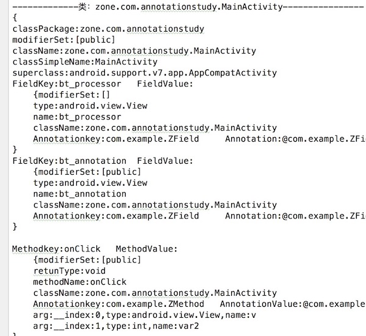

#新手学习

http://www.race604.com/annotation-processing/

https://lizhaoxuan.github.io/

#[环境搭建](./README-cn.md)
点击标题即可跳转~
#项目已封装
导入aptlib module 既可(如果编译成jar 引入则会各种报红 找不到类~) 
  因为有些原因没办法发布到jitpack 。。。。

#知识总结

###使用注意:
1：修改log地址 不然会报错； 每次build可观察 apt项目下的process.txt文件；
修改地址是：apt项目下 utils LogUtils.fileAddress这个属性；
#####如图所示~  显示了收集的信息；


2:每次需要rebuild项目！！！

3：还有不知道为什么  不能用gson去转化实体类，不然会各种报错；

###初始化里的东西
```
messager:用来打印信息；注意：如果Diagnostic.Kind.ERROR的话build会失败；

filer:文件写入  放到文章最后；

elementUtils:获取包名的；等信息；

typeUtils：  Element inter = typeUtils.asElement(typeMirror);
可以把TypeMirror类型弄成 element 一般都是接口等信息（element.asType()）；后面有解释；

```

###获取element注解比较简单

```
element..getAnnotation(ZClass.class);
```

###Package

```
//elementUtils 构造器的时候收集的  
elementUtils.getPackageOf(element).getQualifiedName().toString();
```

### Class(TypeElement)
if (element.getKind() == ElementKind.CLASS) 
 
获取此的类型：
```
element.asType()
结果:zone.com.annotationstudy.MainActivity
```

获取限定符:
```
element.getModifiers() 
结果:[public]  如果不声明 就是这个[]
使用范例：element.getModifiers().contains(Modifier.PUBLIC)
```

获取此name：
```
element.toString()
结果:zone.com.annotationstudy.TestMuplActivity
```

获取父类：
```
if (element.getKind() == ElementKind.CLASS) {
   TypeMirror superClass = ((TypeElement) element).getSuperclass();
    sb.append("superClass--->"+superClass+"\n");
    }
结果：
superClass--->java.lang.Object（没有继承）
superClass--->android.support.v7.app.AppCompatActivity（有继承的）
```

获取接口:
```
if (element.getKind() == ElementKind.CLASS) {
    List<? extends TypeMirror> interfaces = ((TypeElement) element).getInterfaces();
    for (TypeMirror anInterface : interfaces) {
    Element inter = typeUtils.asElement(anInterface);
    sb.append("inter 接口--->"+inter.toString()+"\n");
}
结果：
inter 接口--->zone.com.annotationstudy.CallbakTest
```

获取其类的 字段方法与构造器；
```
for (Element element1 : element.getEnclosedElements())
    sb.append("child:" + element1.toString() + "\t kind->" + element1.getKind() + "\n");
结果：
EnclosedElements:MainActivity(),bt_annotation,bt_processor,kb,onCreate(android.os.Bundle),onClick(android.view.View)
child:MainActivity()	 kind->CONSTRUCTOR
child:bt_annotation	 kind->FIELD
child:bt_processor	 kind->FIELD
child:kb	 kind->FIELD
child:onCreate(android.os.Bundle)	 kind->METHOD
child:onClick(android.view.View)	 kind->METHOD
```


###需要知道的事情:

转：http://www.race604.com/annotation-processing/

这里有一点小麻烦，因为这里的类型是一个java.lang.Class。
这就意味着，他是一个真正的Class对象。因为注解处理是在编译Java源代码之前。我们需要考虑如下两种情况： 

```
try {  
      Class<?> clazz = annotation.type();
      qualifiedGroupClassName = clazz.getCanonicalName();
      simpleFactoryGroupName = clazz.getSimpleName();
} catch (MirroredTypeException mte) {
      DeclaredType classTypeMirror = (DeclaredType) mte.getTypeMirror();
      TypeElement classTypeElement = (TypeElement) classTypeMirror.asElement();
      qualifiedGroupClassName = classTypeElement.getQualifiedName().toString();
      simpleFactoryGroupName = classTypeElement.getSimpleName().toString();
}
```

这个类已经被编译：
这种情况是：如果第三方.jar包含已编译的被@Factory注解.class文件。在这种情况下，
我们可以想try中那块代码中所示直接获取Class。

这个还没有被编译：

这种情况是我们尝试编译被@Fractory注解的源代码。这种情况下，
直接获取Class会抛出MirroredTypeException异常。
幸运的是，MirroredTypeException包含一个TypeMirror，
它表示我们未编译类。因为我们已经知道它必定是一个类类型（我们已经在前面检查过），
我们可以直接强制转换为DeclaredType，然后读取TypeElement来获取合法的名字。

### Field（VariableElement）
if (element.getKind() == ElementKind.FIELD)

获取所在的类：
```
if (element.getKind() == ElementKind.FIELD)
 ((VariableElement) element).getEnclosingElement().toString()
 结果：zone.com.annotationstudy.MainActivity
```

获取限定符:
```
element.getModifiers() 
结果:[public]  如果不声明 就是这个[]
使用范例：element.getModifiers().contains(Modifier.PUBLIC)
```

获取此field的类型：
```
element.asType()
结果:android.view.View
```

获取此field的name：
```
element.toString()
结果:abt_processor
```

获取此field的value：
```
 if (element.getKind() == ElementKind.FIELD) {
    //注意 只有final修饰符的 字段才可以获取到 其他的都是null
   Object fieldValue = ((VariableElement) element).getConstantValue();
    if(fieldValue!=null)
        sb.append("fieldValue:"+fieldValue+"\n");
   }
```

### Method(ExecutableElement)
if (element.getKind() == ElementKind.METHOD)下获取

获取限定符:
```
element.getModifiers() 
结果:[public]  如果不声明 就是这个[]
使用范例：element.getModifiers().contains(Modifier.PUBLIC)
```


获取返回值类型：
```
//method是ExecutableElement
sb.append("methodName:--->"+method.getReturnType()+"\n");
结果：
method return type:--->int
method return type:--->void
```

获取此name：
```
//method是ExecutableElement
sb.append("methodName:--->"+method.getSimpleName()+"\n");
结果：methodName:--->onClick
```


获取参数与参数类型：
```
//method是ExecutableElement
List<? extends VariableElement> pars = method.getParameters();
for (VariableElement par : pars) 
   sb.append("parName:"+par.toString()+"\t parType:"+par.asType()+"\n");
结果：
parName:v	 parType:android.view.View
parName:var2	 parType:int
```

### Filter与JavaFileObject
//生成在某个包下 是和 你生成的类的package有关！
filter.createSourceFile(arg1,arg2)的返回值是JavaFileObject;
arg1:代表 最后要成的文件类名，一般是"原类名+你要生成的后缀"
arg2:是element,暂时是写和不写结果一样,如果有谁知道请告诉我~;


```
try {
        TypeElement classType = classEntity.getValue().getElement();
        //代表最后生成的类名
        String generateValue = classEntity.getValue().getClassName()
                + SUFFIX;
        if (classType!=null&&!generateCache.contains(generateValue)) {
            JavaFileObject jfo = mElementCheckHelper.getFiler()
                    .createSourceFile(generateValue,  //第一个参数是类名；
                     classEntity.getValue().getElement());     //发现第二个参暂时有没有都一样
            Writer writer = jfo.openWriter();
            writer.write(JavaGenerate.brewJava(classEntity.getValue()));
            writer.flush();
            writer.close();
            generateCache.add(generateValue);
        }
    } catch (Exception e) {
        processingEnv.getMessager().printMessage(Diagnostic.Kind.ERROR, e.getMessage());
    }
```
#####注意:生成的类不能生成第二次 覆盖他不可以的；会报错，所以需要建立一个list存这个生成类的名字；
#####每次生成的时候检查 是否包含他；
#####生成的代码路径：


# Reference&Thanks：

https://lizhaoxuan.github.io/

http://www.race604.com/annotation-processing/

https://segmentfault.com/a/1190000002785541

http://blog.csdn.net/lmj623565791/article/details/51931859